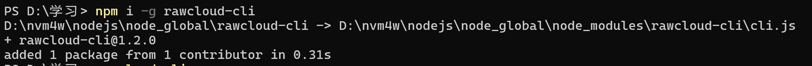
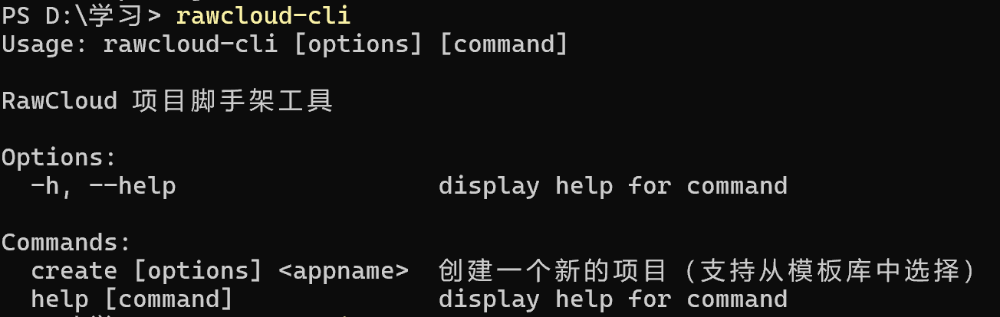
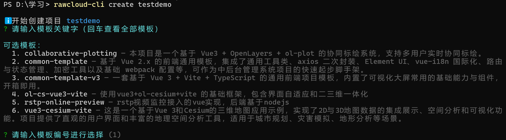

# RawCloud CLI

> Language Switch / 语言切换
>
> [中文](README.zh.md) · [English](README.en.md)

## 概览

RawCloud CLI 是一个轻量级的项目脚手架工具，用于从预定义模板快速创建新项目。

### 功能特点

- 从所选模板创建新的项目目录
- 支持终端交互式模板选择
- 提供更清晰的创建、下载、重试流程提示
- 提供简单的本地命令入口

### 效果展示







### 安装

```bash
npm install
npm link
```

### 使用方法

```bash
rawcloud-cli create <appname>
```

### 示例

```bash
rawcloud-cli create my-app
```

### 开发调试

```bash
node cli.js create my-app
```

### 项目目录结构

```text
rawcloud-cli/
├── cli.js
├── package.json
├── README.md
├── README.en.md
├── README.zh.md
└── lib/
    ├── create.js
    └── http.js
```

### 常见问题

**Q：为什么创建命令会要求选择模板？**

A：CLI 会从 RawCloud 的 Gitee 模板仓库中拉取模板列表，供你在终端中交互式选择。

**Q：如果模板下载失败怎么办？**

A：CLI 会询问是否重新下载。若目标目录已存在，可以使用 `--force` 选项覆盖。

**Q：如何本地测试？**

A：在项目根目录执行 `node cli.js create my-app` 即可。


